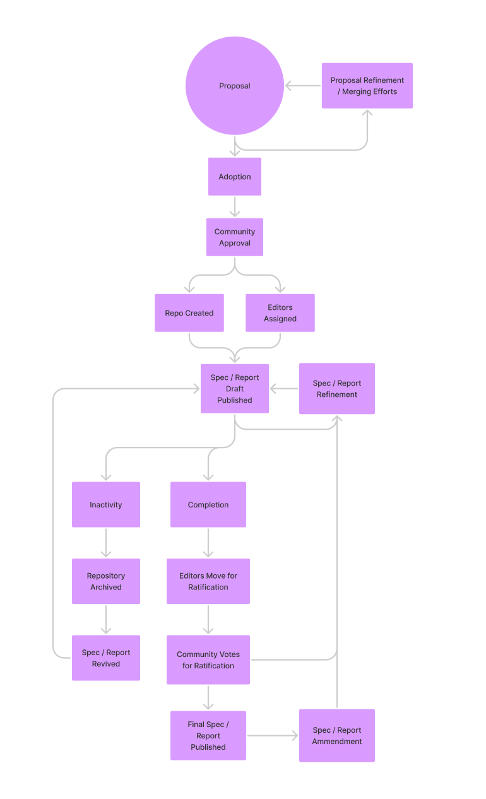

# W3C Metaverse Interoperability Community Group Process

### Proposals

Proposals should be submitted as GitHub issues. You should use either the "Specification Proposal" or "Work Item Proposal" template when creating this issue. When writing these proposals do not worry about defining all terms or trying to write a complete specification. Give a summary of the problem being solved, examples of use cases for the idea being proposed, and a high-level understanding of the implementation of this solution.

Work items are typically specifications, reports, or other documents. Reference implementations of specifications and community documentation efforts may not fit this exact process and should be discussed by the group when it reaches the "community approval" phase.

### Proposal Refinement, Adoption, and Merging of Efforts

Once a work item has been proposed, it needs support. If you are proposing a specification, there needs to be at least two implementors before it can be submitted for community approval. Other work items will be evaluated by the community on a case-by-case basis.

We will encourage similar proposals to merge into a single proposal whenever possible.

Proposals that that have adoption must be approved by consensus at a weekly community meeting. It is up to the community to decide if a work item is within the scope of work of the group. This approval process should not be treated the same as the final approval process of a specification. We as a group understand that ideas need time to grow and should not stop work items from moving on to the draft stage.

If work item proposals are deemed not in scope or there is not adoption of the work item, it should be refined and submitted again or merged with a similar effort.

### Spec / Report Drafts

Once a proposal for a work item is approved, a github repository can be created and editors added to it. Editors should work together on drafts of the report / specification maintained in the repository. Issues and pull requests should be submitted to the repository. Editors will determine the proper working arrangement for composing their work. Non-editors can submit pull requests which the editors can then review and merge.

All contributors must first agree to the [W3C Community Contributor License Agreement (CLA)](https://www.w3.org/community/about/process/cla/).

Specification work can be done asynchronously in the GitHub repository and spec-related agenda items may be added to the weekly meeting to discuss them in real time.

Specifications should be refined until the editors determine they are ready for community group approval.

### Approval

Work item editors may submit their draft spec / report for approval at any weekly meeting. Community members can vote if they have attended 2 out of 3 of the last weekly meetings (including the current meeting).

If the group does not approve a draft, it goes back to the editors for revision.

### Publishing

Once a spec/report is approved it must be published publicly. The W3C Community Group defines the rules for deliverables [here](https://www.w3.org/community/about/process/#deliverables).

### Inactivity

If the community group decides by consensus that a work item is inactive and is unlikely to be picked up again, the issue will be closed or the repository will be archived.

Work items should generally be considered inactive if they have not had any activity in over 3 months.

Work items can be proposed again and repositories revived if activity picks up again.

### Amendment

Finished specifications and reports can be amended. They need community approval before they can be published.