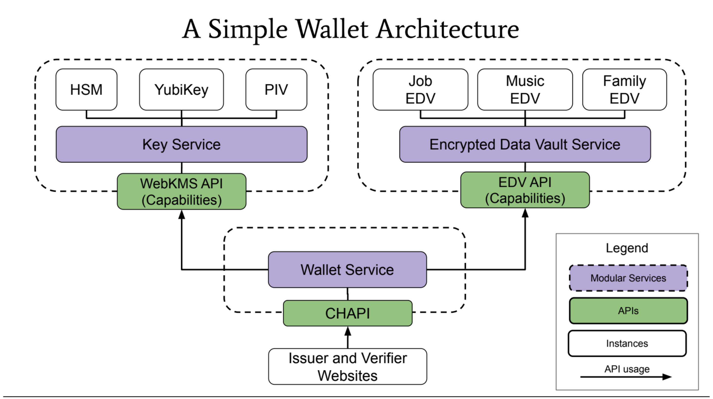

# Open Metaverse Interoperability - XR3ngine Response - Proposed OMI Interfaces

Repo: 
[https://github.com/xr3ngine/xr3ngine](https://github.com/xr3ngine/xr3ngine)
[https://github.com/OMI-Open-Metaverse-Interoperability](https://github.com/OMI-Open-Metaverse-Interoperability)

# Compatibility

We need some sort of compatibility tool to track and test between XR apps and browsers

**Package / Version Manager - Tagging (flags/scopes?) system on/off** 

**Permission tree** - "Public" Content vs. Private 

# Package Systems

- **XRPackage** - Love XRPK and looked at Webaverse tools deeply [https://github.com/xr3ngine/xr3ngine/issues/38](https://github.com/xr3ngine/xr3ngine/issues/38)
- Love [https://web.dev/web-bundles/](https://web.dev/web-bundles/)

# Home servers

A "home base" for personal data and authorization rights

Not required or faceless UX - Guest mode for - easy/auto sign up

List of tech that could be adapted to this need:

- CHAPI wallet
- Solid
- Crypto Wallet
- Matrix homeserver
- Mastodon instance

# Tokenized / Tracked / Smart Assets

NFTs

DiDs + XR Wallet

# Chat / World Log

Matrix is an awesome standard

# Identity / Accounts

See XR Wallet below

## **DiDs** - [https://www.w3.org/TR/did-core/](https://www.w3.org/TR/did-core/)  Add DiDs to everything. Just do it.

## Social

- We have built an instrgram / clubhouse style React UX - Needs Fediverse 2.0 features - currently very traditional architecture [https://github.com/xr3ngine/xr3ngine/tree/dev/packages/social](https://github.com/xr3ngine/xr3ngine/tree/dev/packages/social)
- Activity Pub + Streams working groups have momentum to enhance and extend right now - Amy (Rhioro), Chris Weber - w3c technical architecture - social web
- We probably need to extend friends list and profile - currently out of activity pub scope - [https://www.w3.org/TR/activitypub -](https://www.w3.org/TR/activitypub/) [https://www.w3.org/TR/activitystreams-core](https://www.w3.org/TR/activitystreams-core/)

## World Index / Search

Rely on existing search index standards

Create an easy to parse API

# Data Shapes

Great starts on shapes that can already be used - **CCG UWallet Interop** 

Standardize schema on **JSON-ltd**  [https://www.w3.org/TR/json-ld/](https://www.w3.org/TR/json-ld/)

# Payment

- Lean on existing systems **Web Payments** (XR3 using chargebee)
- Crypto - Webaverse / Metamask

# XR Wallet / XR Pass Roadmap

**Pass portal presentation [https://docs.google.com/presentation/d/1TYTRz7NC4BvUpRzyelfeqgfGQJxWH3O7ZCr3LEgdw4U/](https://docs.google.com/presentation/d/1TYTRz7NC4BvUpRzyelfeqgfGQJxWH3O7ZCr3LEgdw4U/)**

This is a top-level / tracking epic for the XR Pass / XR Wallet (or whatever we decide to call it), that provides authentication, decentralized user profile storage,  (and in the future, digital signature, encryption).

**Relevant Repos:**

- [digitalbazaar/credential-handler-polyfill: Credential Handler API polyfill](https://github.com/digitalbazaar/credential-handler-polyfill)
- [Minimal Demo Verifier](https://chapi-demo-verifier.digitalbazaar.com/)
- [Minimal Demo Wallet](https://chapi-demo-wallet.digitalbazaar.com/) **CHAPI**
- [Minimal Demo Issuer](https://chapi-demo-issuer.digitalbazaar.com/)
- OLD Pull Request
    - [Integrate CHAPI Wallet as an auth method by dmitrizagidulin · Pull Request #369 · xr3ngine/xr3ngine](https://github.com/xr3ngine/xr3ngine/pull/369)

**Specs**:

- [ ]  Specify a way for a CHAPI request to suggest a wallet to the user (if the user does not have one yet), and provide a callback uri to return from wallet registration.
- [ ]  Specify the format of an XR Pass authentication credential.

**xr3ngine (front end)**:

- [ ]  Wire up just-in-time account provisioning (registration for a wallet, creation of a storage user account, see above) when appropriate (on a purchase or when user wants to modify their avatar/settings)
- [ ]  Implement wallet-based sign-in (would work cross-domain, on any compliant xr3ngine server).
- [ ]  Modify User Profile UI to load (and save) their profile from their decentralized storage (that was).

**xr3ngine (back end)**:

- [ ]  Have server generate its own DID and signing keys on installation
- [ ]  Provide a proxy API for account provisioning (front-end would call the xr3ngine account provisioning API, which would in turn create a user storage account on the storage server)
- [ ]  Implement a storage quota system (user can have X custom avatars for free, but beyond that should pay for more storage, etc) that serves as gatekeeper to the storage server.

**DevOps**:

- [ ]  Register a domain for storage server
- [ ]  Set up a VPS (on AWS or DigitalOcean) to host life-server in multi user mode (as a decentralized storage and wallet provider).
- [ ]  Set up SMTP email server on storage server (for wallet account recovery)
- [ ]  Set up exception monitoring on storage server
- [ ]  Set up error log aggregation on storage server

    

**MORE DETAILS**

[XR-Wallet Integration Plan](https://docs.google.com/document/d/18AnUsl7iwl06fPXfWBvT9RWQJbbl_prgudP9Vz6Rg_k/edit)

XR3 system target - LOGIN with Wallet

[https://github.com/xr3ngine/xr3ngine/pull/369/files#diff-be698190a091e06a0bd4948a593057cd175c748008868a35bc7a5a9106b5891cR60](https://github.com/xr3ngine/xr3ngine/pull/369/files#diff-be698190a091e06a0bd4948a593057cd175c748008868a35bc7a5a9106b5891cR60)

# Inspirations and Related Efforts

- Hubs
- JanusXR
- Webaverse
- Jel
- Cryptovoxels
- Neons [https://github.com/Neos-Metaverse/NeosPublic/issues/178](https://github.com/Neos-Metaverse/NeosPublic/issues/178)
